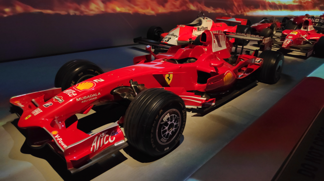
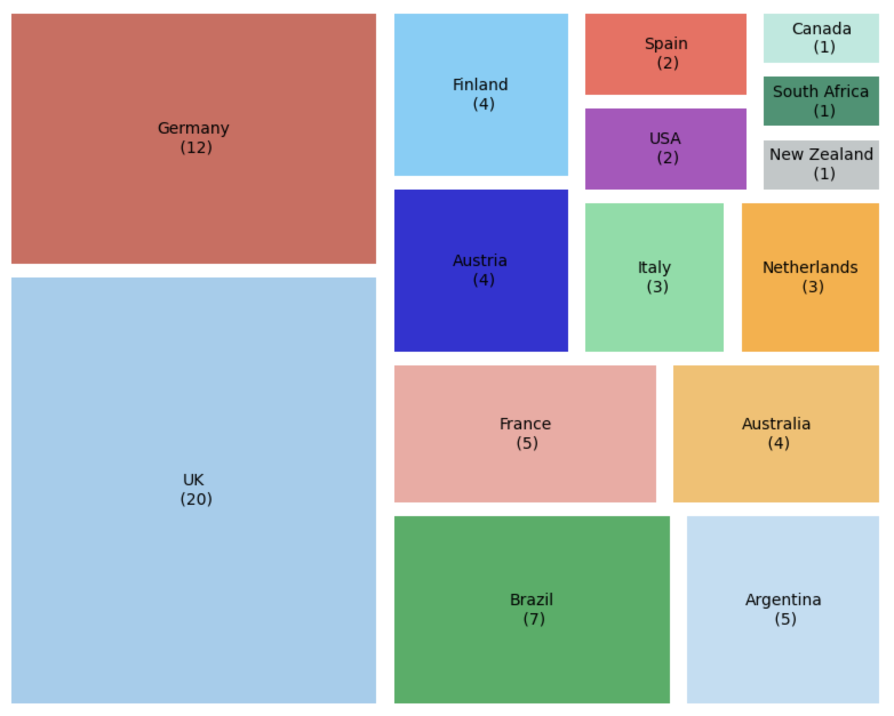
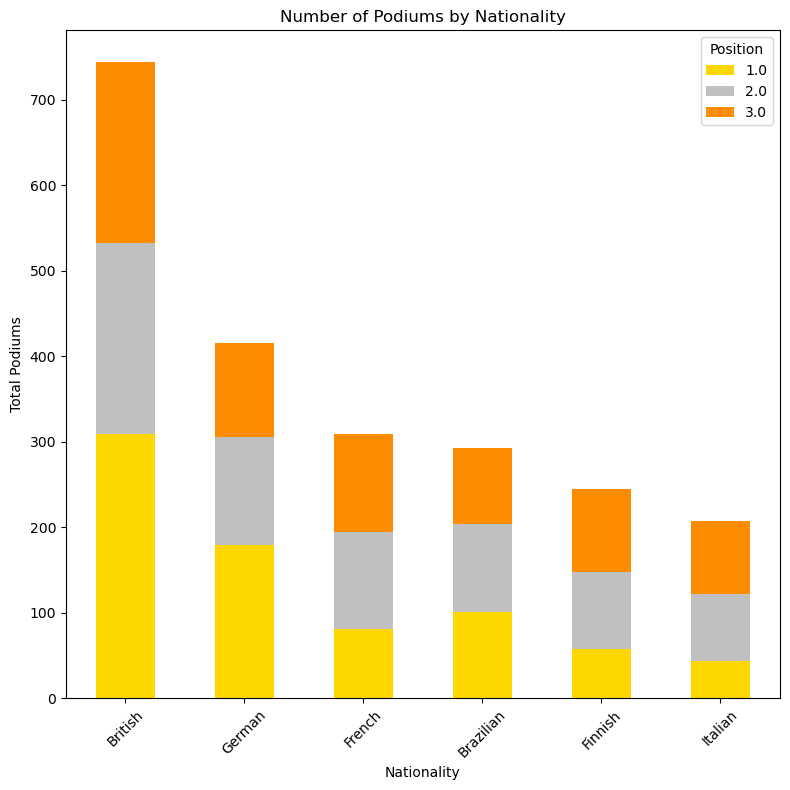
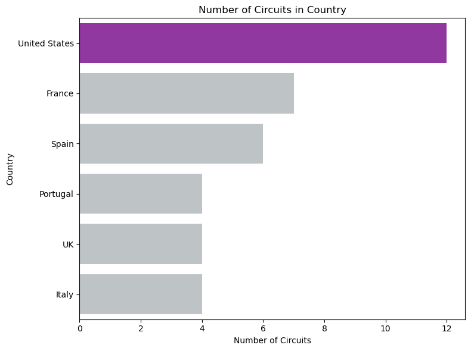
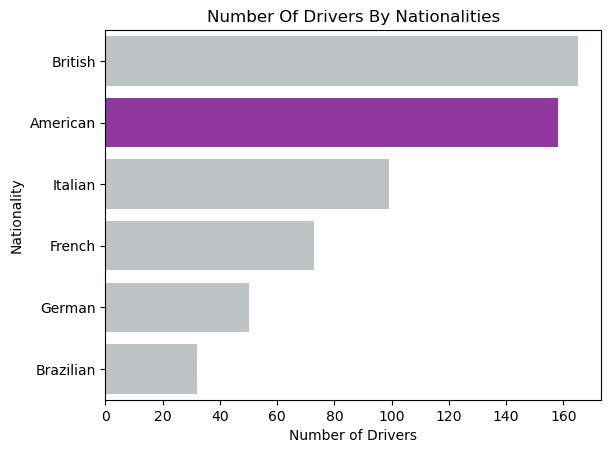
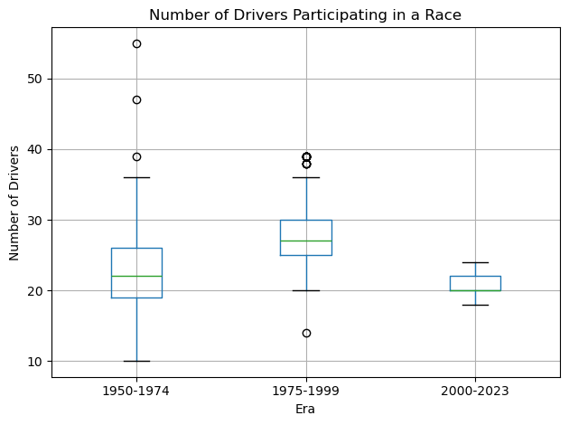
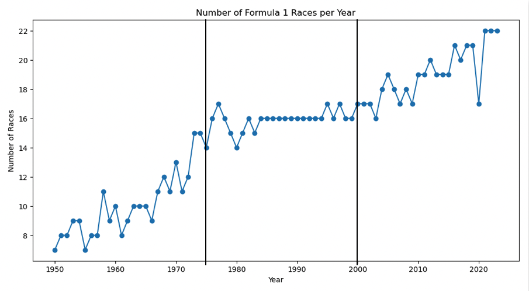
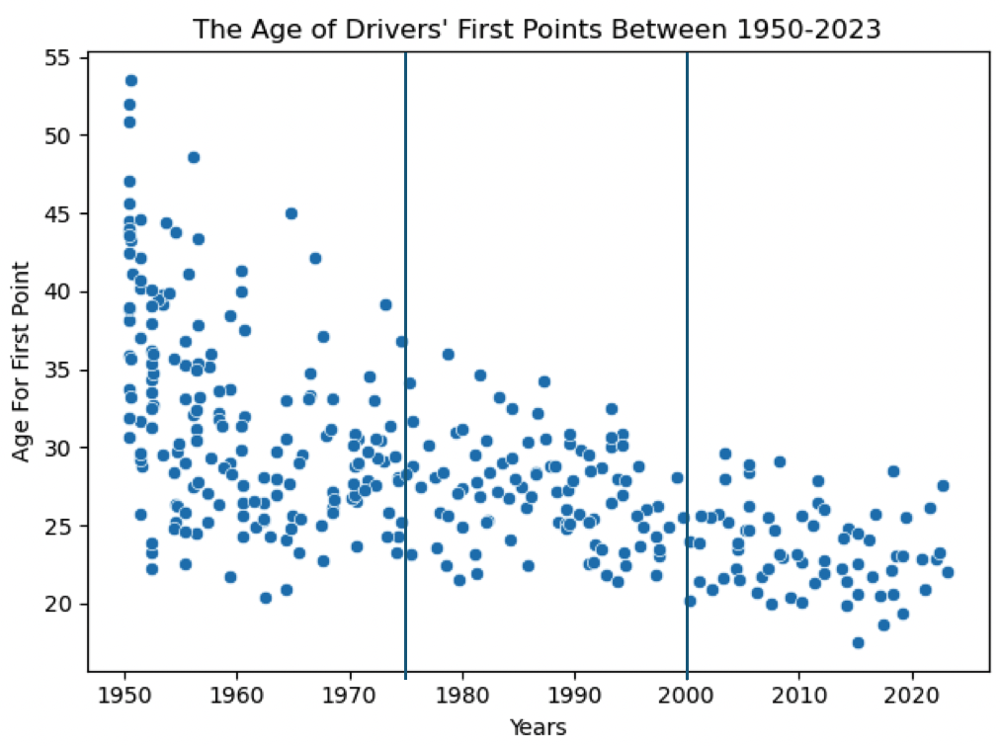

# Beyond the Podium: A Global Journey Through Formula 1 History

## Introduction

I first got hooked on Formula One during the COVID-19 pandemic. Since 2021, I’ve moved from just watching the Netflix show (Drive to Survive) to reading about it. This sport is exciting because of its fast races and the history of great drivers and teams. Finding it endlessly fascinating, I decided to research it in depth and make it the topic of my data science project. I explored interesting aspects of Formula One by asking three questions:

1. Which country won the most championships?  
2. Where does the US rank in Formula One?  
3. How has Formula One evolved?  

---

## The evolution of Formula One

Formula One is famous worldwide for its fast cars and high-tech competitions. It was established in 1950 and has grown a lot since then. Teams use smart strategies and advanced technology to win races.

In the begin ning, some constructors had multiple drivers in the same race. The sport has evolved through the years as cars have been reshaped by technology, aerodynamics, fuel, and tires, among many parameters. In other words, this is not your grandfather’s or even father’s Formula One experience.

### How does it work today?

There are only 10 constructors (teams), and 20 drivers in every race weekend on track. Each team can use two cars (and two drivers), and there are 2 competitions.

1. Drivers’ championship (individual)  
2. Constructors’ championship (team effort)  

The constructors make up the team that builds the car and designs an aerodynamic body. It also sometimes designs and builds the engine. The team has the authority to sign a new driver or release one. They usually have two main drivers and one or two backup drivers in any case of need..

---

## Data

While there are many factors involved in racing, the key data points have mostly been consolidated into [Kaggle dataset](https://www.kaggle.com/datasets/rohanrao/formula-1-world-championship-1950-2020") that covers the championship race data from 1950-2020. This comprehensive dataset covers almost the whole history of this sport, providing 14 informative files about races, drivers, constructors, circuits, and many more.  

While the data was easily accessible, it still took some prep work to make it usable for my purposes to find the answers to the three questions I had defined. I had to merge many files into one table for almost every graph I wanted to create.

---

## Analysis and Insights

### First Question

**Which country won the most championships?**

When I looked at the data, it was clear that the UK stands out. UK drivers lead in almost every category. Together, they have won 20 championships – far more than any single country – as you can see in the graph below (Figure 1).

*Figure 1, Number Of Drivers' Championships.*

The point system is the best way to understand who is the best here. I decided to check the total drivers’ points, and the British drivers got the most. It also leads in the constructors’ championship and even the number of drivers and constructor. The UK won the most podiums, which means, it is obviously the best-ranked country for racing championships (Figure 2).

  
*Figure 2, Podiums By Nationality.*

---

### Second Question

**Where does the US rank in Formula One?**

While searching for the answer to that question, I discovered a very interesting reality. The US has put a lot of effort into Formula One. The US is home to the greatest number of race tracks in the world (Figure 3). It also has had a lot of drivers and teams throughout history (Figure 4). Note the difference between the number of circuits in the US and the rest of the world.

This would lead one to believe that the US is a leader in most Formula One categories. But when I checked the results, I saw that the US isn't doing as well as expected. US drivers tend to score lower than those in the top ten countries. In fact, when measured in terms of driver’s points, the US only ranks in 11th place, though it achieves 8th place in the total constructors’ points.

*Figure 3, The US Invests In Circuits.*

*Figure 4, Second Place In Number Of Drivers For The US.*

---

### Third Question

In the last part of my project, I discuss the evolution of Formula One. I divided the data into three time periods to see trends. This way I could visualize how the rules and technology have changed. Right away, I noticed big differences. The number of drivers in each race used to vary substantially, from 10 to 55, but now there are always around 20 (Figure 5).

*Figure 5, Number Of Drivers In Each Race.*

*Figure 6, Number Of Races Every Year.*

The sport has also become more popular, which you can see by the increasing number of races each season. The graph above shows the number of races steadily climbing since 1950. The unusually steep drop in 2020 is likely due to the pandemic. The number of races hit new highs in subsequent years (Figure 6).

I also looked at drivers' ages when they scored their first points (Figure 7). In the early days, the oldest driver was around the age of 54. Today, drivers start their campaign when they’re younger, usually around 17 or 18. But there are still some new drivers who only score their first points between 25 and 30.

To achieve success in modern Formula One, drivers often begin their racing careers at a younger age compared to earlier times. Historically, participants in races tended to be older. An analysis of the age at which drivers scored their first points highlights this shift. Initially, it was common for drivers to earn their first points at ages older than 35. In contrast, today's drivers typically secure their first points between the ages of 18 and 30, reflecting a trend toward younger competitors entering the sport.

*Figure 7, Drivers' First Points' Age.*

The way points are given out has changed several times too. And It can be shown by looking at the total points through the eras I checked. Another interesting insight I’ve noticed was how today’s teams are not that far apart from each other in terms of the number of points. In contrast, in the earlier era, there was a much greater difference between the winning teams and others.  

---

## Conclusion and future work

The changes in Formula One show how the sport adapts to keep up with increasing concerns about safety while also meeting the demand for greater speed. At the beginning, there were not so many regulations. Every driver with a fast car could join the race with his equipment. The number of fatality accidents in the early stage was insane.  

Today, an insistence on improving those numbers has led to safer and more reliable cars, as well as better training for drivers. The driver today has to have a special license to drive those cars. I don’t know if the point system we have today will last forever, but I believe that the FIA (Fédération Internationale de l'Automobile), the governing body of motor sport, will try to keep this sport in a good place with safe circuits, and keep developing safety for the drivers and the team.

I wish I could have a deeper analysis of regulatory changes such as safety, circuits, engines. It’s fascinating to me to understand this and follow the trends about these topics. I also didn’t discuss sprint races, shorter and more intense versions of the races, added to enhance the race weekend. The schedule of a sprint weekend is challenging for the drivers and can give an opportunity for any of them to deliver a good result and get points. Unfortunately, as the sprint format is new and has started in 2021 with only a few races during the season, there is not enough data on it to analyze the impact of this trend.  

---

Thank you for reading my blog about F1 through the lens of countries and their achievements. Hope you enjoyed it.  

I invite you to take a look at my [GitHub](https://github.com/ChTomer) for more of my work. And you are very welcome to reach me on my [LinkedIn](https://www.linkedin.com/in/tomer-choresh/).